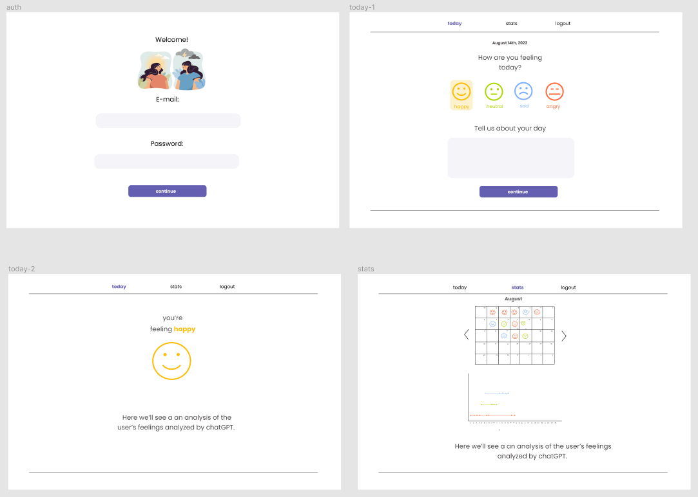

# Mood Tracker

  

## Table of Contents

1. [Project Description](#project-description)
2. [Tech Stack](#tech-stack)
3. [Prototypes](#prototypes)
4. [Author](#author)

## Project Description

Mood Tracker is an app designed to help users monitor and analyze their daily moods. It provides a platform for users to record their mood and daily activities, and utilizes OpenAI's natural language processing to analyze their input and provide personalized insights.

The app is built using a modern tech stack including Next.js for the frontend, Supabase for data storage, OpenAI for text analysis, Chart.js for data visualization, and Tailwind CSS for styling. Its user-friendly interface and insightful analysis make it a valuable tool for gaining self-awareness and tracking mood trends over time.

## Tech Stack

## Prototypes

* Mobile

* Desktop!

## Author

| Ziomara Jiménez |   |
